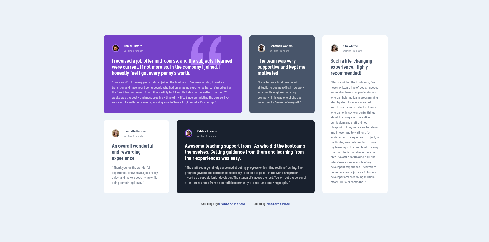

# Frontend Mentor - Testimonials grid section solution

This is a solution to the [Testimonials grid section challenge on Frontend Mentor](https://www.frontendmentor.io/challenges/testimonials-grid-section-Nnw6J7Un7). Frontend Mentor challenges help you improve your coding skills by building realistic projects.

## Table of contents

- [Overview](#overview)
  - [The challenge](#the-challenge)
  - [Screenshot](#screenshot)
  - [Links](#links)
- [My process](#my-process)
  - [Built with](#built-with)
  - [What I learned](#what-i-learned)
  - [Continued development](#continued-development)
  - [Useful resources](#useful-resources)
- [Author](#author)

## Overview

### The challenge

Users should be able to:

- View the optimal layout for the site depending on their device's screen size

### Screenshot

### Links

- Solution URL: (https://your-solution-url.com](https://www.frontendmentor.io/solutions/responsive-page-css-gridcss-flexboxcss-media-query-sZX77BvXvH))
- Live Site URL: (https://mate1225.github.io/testimonials-grid-section/index.html)

## My process

-i started with the basick layout (html/css grid)
-then i writed the font sizes and the margines,pedding...
-then i maked the site responsive
-after thet i did a bit of bug fix (i had isue whti zooming ) and made the css file a bit more readable.

### Built with

- Semantic HTML5 markup
- CSS custom properties
- Flexbox
- CSS Grid
- Desktop-first workflow (but i recomend the mobile first workflow)

### What I learned

Whit this challenges i leared how to use css grid and felxbox together.
I also leard how you can pozition a backround image precisely.

### Continued development

i want to continue the learning on css grid, because i had some trouble with the sizeing of the grid items.

### Useful resources

- (https://www.youtube.com/watch?v=rg7Fvvl3taU&t=464s)- This helped me with the fixing of the zooming bug that i created during the making of this project.
- (https://css-tricks.com/snippets/css/complete-guide-grid/) - This is a good site if you forget how some properties works

## Author

- Website - [Mészáros Máté](https://mate1225.github.io/)
- Frontend Mentor - [mate1225](https://www.frontendmentor.io/profile/mate1225)
